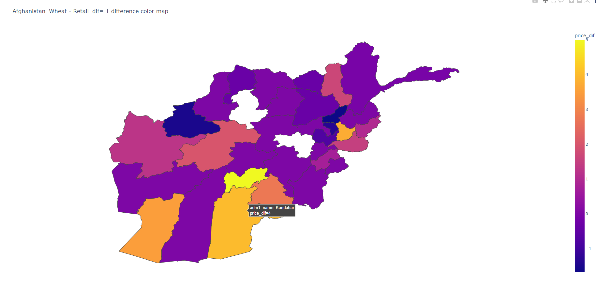
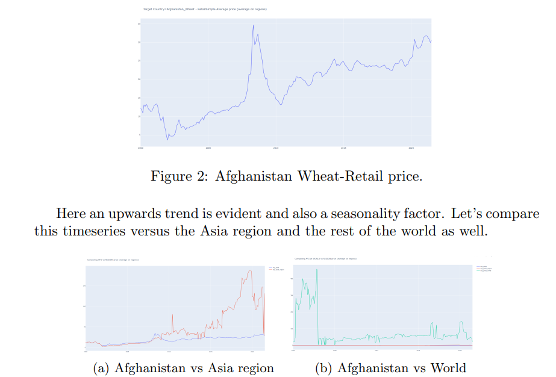
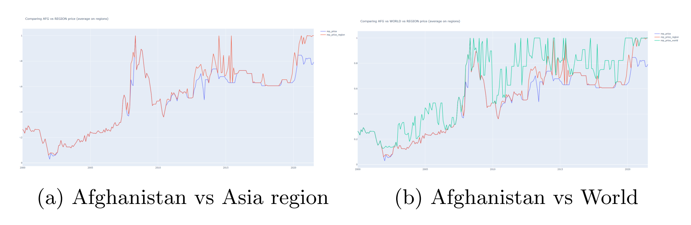
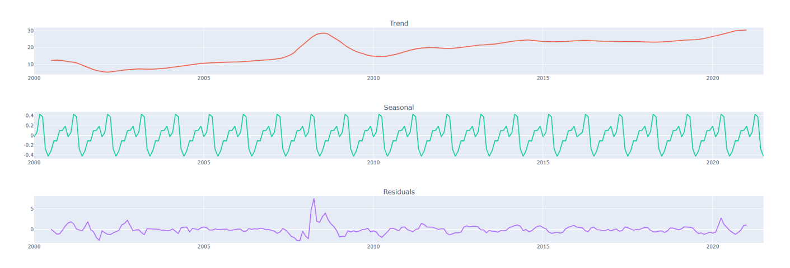
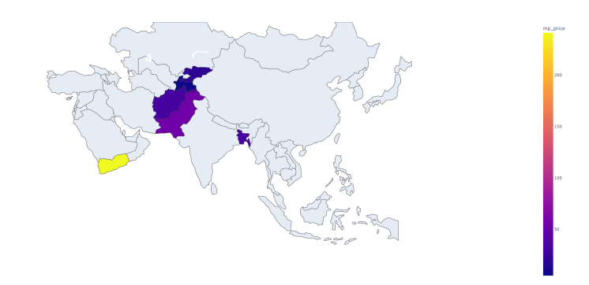
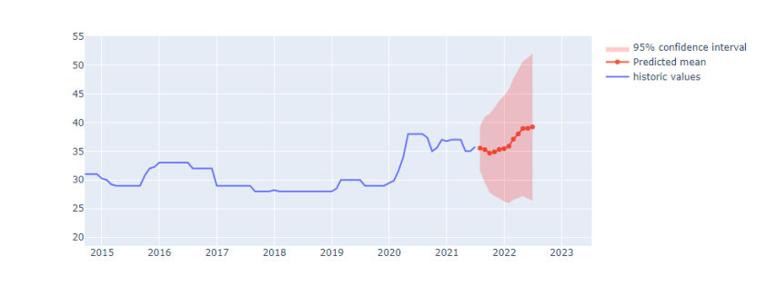

# Supply_Chain_Planning_Optimization

Working Url: TODO


## Table of Contents

- [Introduction](#introduction)
- [Project Overview](#project-overview)
- [Example](#example-time-series-analysis)
- [Prerequisites](#prerequisites)
- [Installation](#installation)
- [Usage](#usage)

## Introduction
 For the purpose of this study an analysis on monthly food prices will be produced
 by examining an old repository that consists of global nationwide datapoints.
 Each row of this dataset provides a datapoint that consists of multiple variables
 that can be used to extract insights on food allocation per country per region.

 This codebase has all the necessary tools to create such analysis and provides a friendly interface via plotly to extract insights in an interactive manner.

## Project Overview
 The dataset consists of a 215MB file, with 2050638 rows and 18 columns / features. This study focuses on a specific region and commodity, namely Region : Afghanistan Commodity : Wheat– Retail The focus produces a reduced dataset that consists of 2312 rows and 18 columns / features.

## Example Time series Analysis
 To illustrate the power of the automated procedure an analysis on the country Afghanistan and on commodity Wheat(Retail) will be presented in a short manner.

 Geographical Analysis
 Here a colomap is produced that illustrated the price difference per month per region. The price is represented as 1 sac(~30kg) of goods per unit.

 

 Timeseries Analysis

 A second step would be to look the prices as timeseries and dive into the statistical properties of these signals. The focus here is again Afghanistan and all its regions on average for the commodity of wheat. 

 

 An immediate insight is that prices in Asia skyrocket after 2010 compared to Afghanistan region. Moreover prices in a global scale seem very volatile as for example prices in Somalia can reach 10k.

 The module offers normalization that can make the plots more readable, a min max normalize will produce something like this:

 

 In order to increase the depth of the analysis a seasonal decomposition is being performed. The chart below shows the decomposition into trend, seasonality and residuals.

 

 It is evident from the previous plot that there is a seasonality effect with a period of 1 year. This is something we would expect as the study is on wheat commodity and validates the methodology.

## Example2 Sourcing, planning and predicting
 A goal of this study would be to decide where would be ideal to source the commodity and thus a geo plot of recent prices around the region is presented.

 

 - Due to incomplete data / unavailability of the commodity from all the neighboring countries, sourcing from Tajikistan would be a good recommendation as the price is 1/5 of the average of the country of Afghanistan.
 - An alternative would be sourcing the commodity from Kyrgyzstan but the price difference (20/31) might not be sufficient to label this as an efficient trade due to missing factors as trade agreements, transportation infrastructure, cost, quality, and reliability of suppliers.

 Prediction of prices

 The task of predicting time series is in general a non trivial task. In order to provide a basis an autoregressive model is used and presented on historical data to give a forecast and confidence intervals. The module can be easily enhanced with several other machine learning methods.

 

 The codebase provided serves as a user friendly tool and as an automation script library to inspect and plan commodities based on the wfp data. It does not factor the geopolitical relations and disasters (floods, wars etc) that are major features during the supply and chain optimization procedure.

## Prerequisites

1. Python version 3.6 or higher (with a not that above 3.12 setuptools and some other components are not preinstalled in any environment and will be needed to be installed before the requirements.txt)
2. Global food prices, downloadable from `https://data.humdata.org/dataset/wfp-food-prices/resource/12d7c8e3-eff9-4db0-93b7-726825c4fe9a`

## Installation

Install the required Python packages:

```bash
pip install -r requirements.txt
```

## Usage

1.  Linear approach

In order to facilitate an easy approach a simple run via python main.py from
the src directory will produce all the results needed in a linear fashion. There
are 3 ways that we can define inputs:
	
- Run python main.py and it will prompt for inputs.
- Run python main.py ”Afghanistan” ”Wheat- Retail” or in general python main.py ”COUNTRY” ”COMMODITY”.
- Run with python main.py a a a, Define inputs Manually at main.py line 39

2.  Interactive approach

A dash application is being provided that works for the target country =
Afghanistan and selected commodity = Wheat- Retail. Expansion is trivial
with a dictionary of pairs country- country id and commodity- commodity id.
A simple python app.py will launch the test server at http://127.0.0.1:8050/
- Fill: Type Country eg AFG block
- Select: Commodity type
- Press : LOAD/RELOAD DATA
- Select: Dataset Focus


From then you can plot price, geographical plots, train arima model and predict
with confidence intervals. The geographical plots can be modified via the
difference in months input text that modifies the time horizon.
It is recommended to leave last the decomposition plot as the front end is
not stable enough for expansive resolutions (The result runs perfectly but the
screen expands and the user needs to slide down the page to find the rest of the
plots.